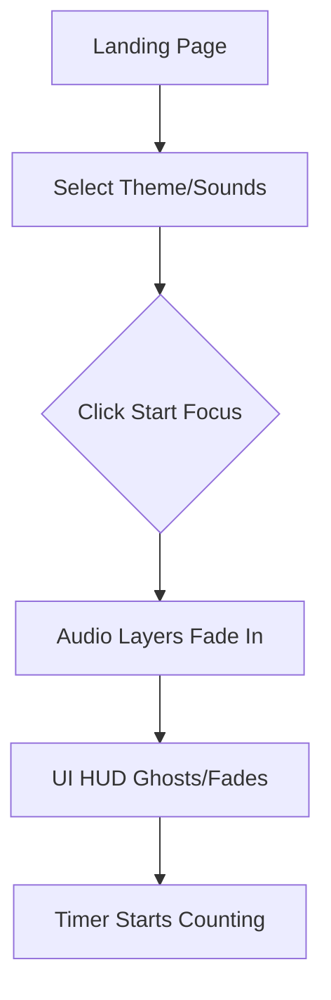
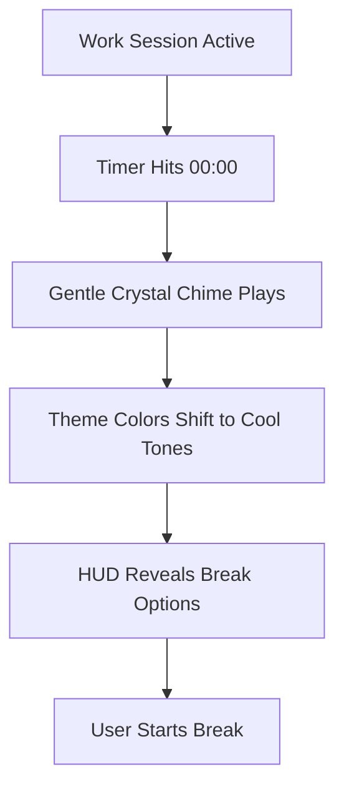

# UX Design Specification VibeSpace

**Author:** Enzo
**Date:** 2026-05-10

---

## Executive Summary

### Project Vision

VibeSpace is a minimalist digital sanctuary designed to facilitate deep focus and relaxation. By merging a functional Pomodoro timer with immersive ambient soundscapes and dynamic, aesthetic visuals, it creates a cohesive sensory environment that minimizes distraction and maximizes flow. The vision is to provide a "zero-configuration" experience where users can transition from stress to focus in seconds.

### Target Users

- **Students & Academics:** Needing a consistent, calming environment for long study sessions.
- **Developers & Creatives:** Seeking a "digital blanket" of sound and color to enter flow state during complex tasks.
- **Remote Workers:** Looking for a tool to manage work/break intervals while maintaining a peaceful home office atmosphere.
- **Casual Users:** Seeking a quick "stress reset" through immediate immersion in nature-inspired soundscapes.

### Key Design Challenges

- **Distraction vs. Atmosphere:** Ensuring that visual animations and ambient sounds support focus rather than pulling attention away from the user's primary task.
- **Minimalist Complexity:** Providing powerful audio mixing capabilities (multiple layers) and theme options without cluttering the interface or requiring manual configuration.
- **Aesthetic Readability:** Maintaining high contrast and clear visibility for the timer and controls against dynamic, color-shifting backgrounds.
- **Instant Immersion:** Overcoming browser autoplay restrictions gracefully to ensure the "Vibe Engine" starts seamlessly upon user arrival.

### Design Opportunities

- **Sensory Synchronization:** Creating a unique "Vibe Engine" where the rhythm of visual shifts, the character of ambient sound, and the timer's state all work in harmony.
- **Emotional Design:** Using color psychology and high-quality audio to intentionally shift the user's mood from frantic to focused.
- **Portfolio-Grade Polish:** Leveraging hardware-accelerated animations and refined typography to create a high-aesthetic experience that feels premium and intentional.

## Core User Experience

### 2.1 Defining Experience

The defining experience is the **"Atmospheric Snap"**—the precise moment when the user clicks the "Start" button and the UI smoothly transitions from a static configuration state into a living, breathing sanctuary. The background begins its slow, rhythmic pulse, the selected sound layers fade in concurrently, and the Pomodoro timer starts its silent countdown. This transition must feel like closing a heavy door on a noisy street and entering a quiet room.

### 2.2 User Mental Model

Users bring a "Digital Blanket" mental model. They don't want to "use" an app; they want to "occupy" a space. They view the timer not as a deadline generator, but as a container for their focus. Their expectation is "Zero Config, High Reward"—they expect that even without touching a single slider, the default "Vibe" will be high-quality and effective.

### 2.3 Success Criteria

- **Latency-Free Layering**: Audio layers must sync and play without stuttering or delay.
- **Sub-perceptual Transitions**: Theme changes and state shifts (Work to Break) must occur over 2-3 seconds to avoid jarring the user out of flow.
- **Low Cognitive Load**: The timer should be readable with a peripheral glance, never requiring the user to "focus" on the focus tool.
- **Battery/Resource Efficiency**: The app must not make the laptop fans spin up, which would break the "calm" atmosphere.

### 2.4 Novel UX Patterns

- **Sync-Fade Interaction**: When the timer starts, all active sound layers fade in together using a custom easing curve that matches the visual "zoom" or "glow" of the timer.
- **Contextual HUD**: Controls for sound mixing and theme selection are visible during setup but "ghost" (fade to 10% opacity) during an active focus session, reappearing only on mouse movement or touch.
- **The "Vibe Slider"**: A single master slider that proportionally scales all active ambient layers while maintaining their relative mix.

### 2.5 Experience Mechanics

1. **Initiation**: A centered "Start Focus" button that glows softly.
2. **Interaction**: Dragging sound icons onto a "Stage" or using simple vertical sliders. Hovering over the timer reveals "Pause" and "Reset" controls.
3. **Feedback**: A subtle circular progress ring around the timer that fills with a gradient. Audio levels peak and trough slightly in rhythm with the background animation.
4. **Completion**: The screen "exhales"—the colors shift to a cooler palette (e.g., deep blue/green), and a high-frequency, low-volume "crystal chime" plays once.

### 2.6 Platform Strategy

- **Web-First (SPA/PWA):** Chosen for instant accessibility and zero-install friction. The application must behave like a native app, especially regarding persistent audio playback and state retention.
- **Responsive Interaction:** 
    - **Desktop:** Keyboard shortcuts (e.g., Space for Start/Pause, R for Reset) are essential for a professional workflow.
    - **Mobile/Tablet:** Touch-optimized sliders and buttons for effortless "vibe mixing" while away from a desk.
- **Audio Reliability:** Leverage the Web Audio API to ensure gapless looping and robust playback even when the browser tab is in the background.

### 2.7 Effortless Interactions

- **One-Click Atmosphere:** Switching themes should instantly reconfigure the entire sensory environment (visuals, animations, and recommended sound balance) without interrupting the timer.
- **Intuitive Sound Mixing:** Ambient layers (Rain, Cafe, etc.) are managed via simple, tactile sliders that provide immediate auditory feedback.
- **Persistent Sanctuary:** The app silently saves every volume and theme preference to LocalStorage, ensuring the user's "sanctuary" is exactly as they left it upon return.

### 2.8 Critical Success Moments

- **The "Flow Trigger":** The precise moment the user clicks 'Start' and the sensory layers synchronize, creating an audible and visual 'click' into a focused state.
- **The "Gentle Reward":** The transition from a Work session to a Break session, marked by a soft, non-intrusive chime and a shift to a more relaxed visual palette.

### 2.9 Experience Principles

- **Frictionless Immersion:** Every design choice must reduce the time and effort between landing on the site and entering a flow state.
- **Atmospheric Utility:** Functional tools (like the timer) must be aesthetically integrated into the environment, appearing as natural parts of the "vibe" rather than overlays.
- **Intentional Calm:** Avoid jarring transitions, high-contrast alerts, or sudden audio changes. Everything moves with a rhythmic, predictable flow.
- **User Agency:** While the experience is curated, users have total, effortless control over their sensory inputs.

## Desired Emotional Response

### Primary Emotional Goals

- **Calm:** Reducing the user's heart rate and mental noise through soothing sensory inputs.
- **Focused:** Channeling the user's attention toward their task without external distractions.
- **Protected:** Creating a sense of a "digital sanctuary" or a "cocoon" where the outside world is temporarily muted.

### Emotional Journey Mapping

- **Entrance:** Curiosity and immediate relief. The user feels a visual and auditory "exhale" upon landing.
- **Configuration:** Playful control. Mixing sounds and selecting themes feels like a low-stakes, creative prep ritual for work.
- **Active Session:** Deep flow. The user eventually stops "seeing" the app as it becomes a rhythmic background companion.
- **Session End:** Satisfaction and clarity. The transition to the break state feels like a gentle reward, not an interruption.
- **Returning:** Reliable comfort. The user feels a sense of belonging to a space that "remembers" them.

## UX Pattern Analysis & Inspiration

### Inspiring Products Analysis

- **Tide (Focus App):** Masterful use of nature sounds and minimalist typography. The UX feels "breathable" and light.
- **Lofigirl (YouTube Streams):** Demonstrates the power of a single, consistent visual loop to anchor focus. The "Lo-fi" aesthetic is highly effective for the target demographic.
- **Forest:** Uses visual metaphors (growing trees) to represent time spent focusing. This makes intangible progress feel concrete and rewarding.

### Transferable UX Patterns

- **The "Zen" Toggle:** A single action that hides all non-essential UI, leaving only the timer and the vibe.
- **Tactile Mixing Sliders:** Using large, rounded slider thumbs that feel "soft" and responsive, mimicking analog audio equipment.
- **Progressive Disclosure:** Keeping advanced audio settings (like individual layer volumes) hidden behind a simple "Mixer" icon until needed.

## Visual Design Foundation

### Color System

- **Midnight (Default)**: Background: #0F172A (Slate 900), Accents: #38BDF8 (Sky 400), Text: #F8FAFC (Slate 50).
- **Forest**: Background: #064E3B (Emerald 900), Accents: #10B981 (Emerald 500), Text: #ECFDF5 (Emerald 50).
- **Sunset**: Background: #451A03 (Orange 900), Accents: #F59E0B (Amber 500), Text: #FFFBEB (Amber 50).
- **Semantic Mapping**: Success (#10B981), Warning (#F59E0B), Error (#EF4444).

### Typography System

- **Primary Typeface**: Inter (Sans-serif) - chosen for its high legibility, neutral character, and modern feel.
- **Hierarchy**:
  - **H1 (Timer)**: 3.5rem (56px), Semi-bold, Monospace numbers to prevent layout shift.
  - **H2 (Section Headers)**: 1.25rem (20px), Medium.
  - **Body**: 0.875rem (14px), Regular.
- **Rationale**: Minimalist typography ensures that the UI remains "light" and doesn't distract from the environmental visuals.

### Spacing & Layout Foundation

- **Base Unit**: 8px grid system for consistent spacing.
- **Layout Approach**: Centered, balanced HUD. Controls are anchored to the edges (top/bottom) or tucked into retractable side panels to keep the central space clear for the timer and ambient visuals.
- **Visual Weight**: Airy and spacious (Low Density). Significant white space around the timer to create a "focus halo".

### Accessibility Considerations

- **Contrast**: All theme combinations meet WCAG AA (4.5:1) standards for text readability.
- **Focus States**: High-visibility glowing rings around active controls to support keyboard navigation.
- **Reduced Motion**: Option to disable background animations for users with vestibular sensitivities.

## Design Direction Decision

### Design Directions Explored

- **1. Minimalist HUD**: Clean lines, centered timer, and subtle background gradients.
- **2. Skeuomorphic Sanctuary**: Using textures (wood, fabric) and analog dials for a tactile feel.
- **3. Abstract Flow**: Generative art background that reacts directly to sound frequencies.

### Chosen Direction: "Ambient HUD"

A centered, floating timer with glassmorphism effects (backdrop-blur) for control panels. The background features slow-moving, full-bleed animated gradients that shift colors based on the selected theme.

### Design Rationale

This direction maximizes immersion while keeping functional elements clearly separated from the background noise. Glassmorphism provides a "modern" feel that aligns with the target demographic of developers and students.

## User Journey Flows

### Journey: Start Focus Session

### Journey: Session Completion

### Journey Patterns

- **Fade-to-Focus**: Common pattern where non-essential UI elements reduce opacity during active work.
- **Seamless Transition**: No hard page reloads; all state changes occur within the single-page view via smooth transitions.

## Component Strategy

### Design System Components

- **Buttons**: Custom variants of standard shadcn/ui buttons with added "glow" effects.
- **Sliders**: Tactile, oversized sliders for audio mixing.
- **Cards**: Backdrop-blur containers for settings and sound selections.

### Custom Components

- **Vibe Engine**: A Canvas/WebGL background renderer for hardware-accelerated color transitions.
- **Breathe-Timer**: A timer component that slightly scales (1-2%) in a rhythmic pulse.
- **Mixer Stage**: A dedicated area for managing multi-layered ambient sounds with visual feedback.

### Implementation Roadmap

- **Phase 1**: Core Timer and Audio Player.
- **Phase 2**: Vibe Engine and Theme Switching.
- **Phase 3**: Mixer Stage and Persistence.

## UX Consistency Patterns

### Button Hierarchy

- **Primary**: Solid background with a soft outer glow (e.g., "Start Focus").
- **Secondary**: Ghost buttons with subtle backdrop-blur (e.g., "Customize").
- **Tertiary**: Icon-only controls for quick actions (e.g., "Mute", "Fullscreen").

### Feedback Patterns

- **Success**: Soft emerald pulse around the timer.
- **Interaction**: Audible "click" (optional) and visual scale-down on press.

## Responsive Design & Accessibility

### Responsive Strategy

- **Mobile**: Single-column layout. The Mixer is moved to a bottom sheet. The timer remains centered but scaled down.
- **Desktop**: Multi-column HUD with dedicated side panels for "Vibe Settings" and "Focus History".

### Accessibility Strategy

- **WCAG Level**: AA Compliance.
- **Keyboard Support**: Full navigation via Tab and shortcuts (Space, R, M).
- **Screen Readers**: Descriptive ARIA labels for all ambient layers and timer states.

### Testing Strategy

- **Visual Regression**: Ensuring blur and gradients render correctly across browsers.
- **Performance**: Auditing CPU/GPU usage to ensure no impact on background focus.
